## Welcome to Environment and Health App 

The Environment and Health App is to help users to analyze and visualize data about environment and health. It can be used to do horizontal analyses among different countries, states and cities. You can also use it to do time series analyses. Besides, you can get summary statistics and brief introduction of your health status.

In terms of dataset, users can analyze Air Quality Index (AQI) and global temperature data.

## Glossary

 

[AQI](https://en.wikipedia.org/wiki/Air_quality_index): An air quality index (AQI) is a number used by government agencies to communicate to the public how polluted the air currently is or how polluted it is forecast to become. 

[AQI levels of Health concern](https://cfpub.epa.gov/airnow/index.cfm?action=aqibasics.aqi): The purpose of the AQI is to help you understand what local air quality means to your health. To make it easier to understand, the AQI is divided into six categories. Each category corresponds to a different level of health concern.

[CBSA](https://en.wikipedia.org/wiki/Core-based_statistical_area): The term Core Based Statistical Area (CBSA) refers collectively to both metropolitan statistical areas and micropolitan areas. 

## Dataset Overview

### Air Quality Index Dataset

* Annual AQI dataset contains annual AQI information from 2000 to 2017 by Core Based Statistical Area (CBSA).

* The U.S. pollution dataset contains four major pollutants (Nitrogen Dioxide, Sulphur Dioxide, Carbon Monoxide and Ozone) AQI data for every day from 2000-2016. All the data is scraped from the database of U.S. [EPA](https://aqsdr1.epa.gov/aqsweb/aqstmp/airdata/download_files.html)

* AirQualityTracking dataset contains different air quality values of different state. The dataset was from Center for Disease Control and the air quality was a combination of ozone and PM2.5. 

### Global temperature datasets

Notes: There are some missing values in the following datasets, which leads to the incompleteness of the temperature map in some year.

* Global Temperature contains global land average temperature from 1750-2015. Note: there are some missing values in this dataset.

* Global Land Temperature by Country dataset contains global land average temperature from 11/1743-09/2015. 

* Global Land Temperature by State dataset contains global land average temperature from 11/1743-09/2015.

## Guide to App

### Air Quality Index

#### AQI Plot

##### Analysis selection - Boxplot of AQI: 

This boxplot can show you how AQI distributed from 2000-2017. You can use the notches on the boxplots to analyze whether there is strong evidence (95% confidence) that their medians differ, whether the median changed much during specific time period and whether the distribution approximate to normal distribution or it was skewed.

+ **Inputs Selection**: 
 

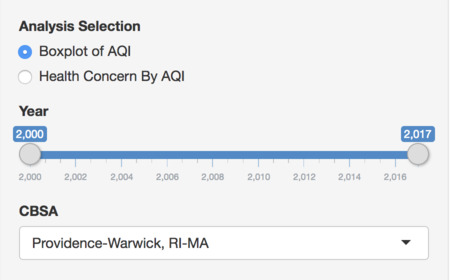

You can use the Year slider change the time period. We set the default value at 2000-2017 (the longest time period for Annual AQI dataset).

Select the CBSA you are interested and then red spots on the boxplots can tell you how the air quality in that area was compared to other CBSAs in each year (Above median or below median). The default value of CBSA is Providence.

+ **Boxplot:**

 

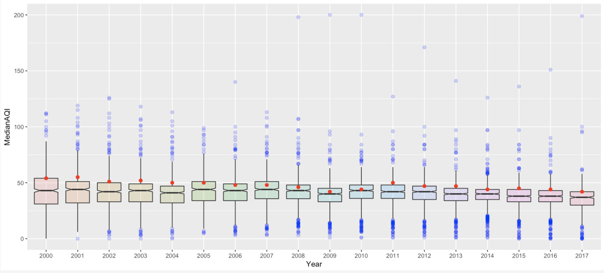

Using the default value of each selection, the boxplots display as above.

##### Analysis selection - Health Concern by AQI:

You can use the Health Concern Plot analyze the trend of percentage of each health concern level during a specific time period and compare the percentage among CBSAs.

+ **Inputs Selection**:

 

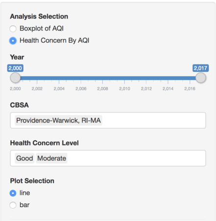

Choose year period, CBSA and Health Concern Levels you want to analyze. You can select multiple CBSAs and Health Concern Levels to do comparison analyses. The picture above show you the default values of each selection.

**Plot Selection**:

For users who want to do comparison during a relatively long time period, the better choice is to select line plot and analyze the trend.

For users who want to do comparison only in one or a few years, select bar plot here. For example, if users want to compare the percentage of health concern levels between different CBSAs only in a specific year (2008), choose bar plot and the graph will display properly.

+ **Health Concern Plot:**

   

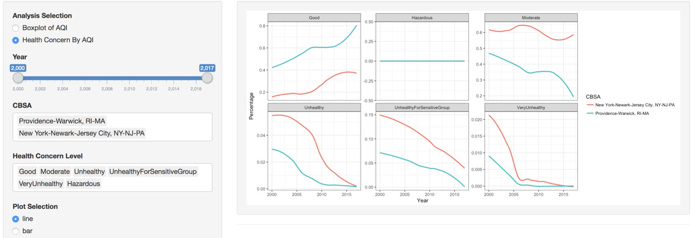
  
   
  
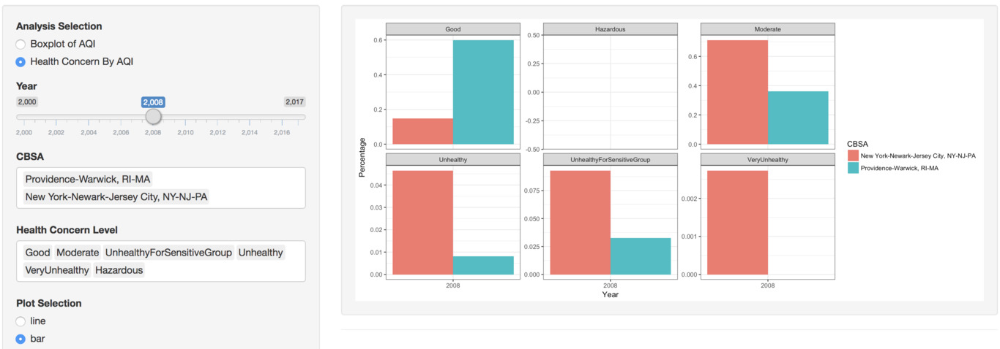
#### Pollutant AQI Trend

You can use these time series plots to analyze the trend of AQI by pollutant. 

+ **Inputs Selection**

You can select multiple inputs for cities and pollutants to do comparison. Use the Year slider to choose the time period (Default value is 2000-2016).

   
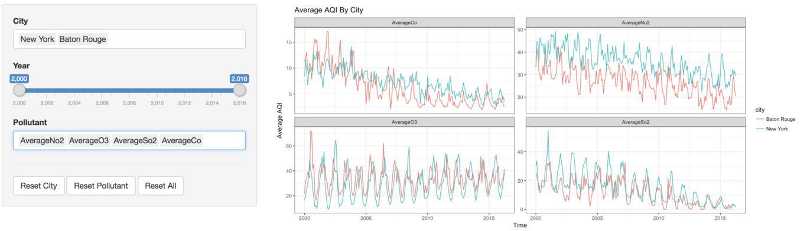
   

#### Cluster
+ **Data**

The data comes from annual aqi by cbsa. For the pollution part, the variables are percentage of a certain pollutants because some of the original data are zero. For the health part, the input variable is the number of different situations of days(Good, unhealthy, etc). The cluster count is the number of clusters you want to divide.

### Map

#### Air Quality Map 

+ **Input Selection**

The year is the certain year you want to specify to get to know about the air quality of the United States. The color is the kind of color you want to display in the state map.

+ **Note**

The data is from the center of disease control. The air quality is a combination of the ozone and PM2.5. 

#### Temperature Map

+ **Inputs Selection**

   
  

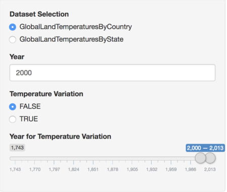

   
  
  Use the two datasets analyze temperature by countries or states.

**Note**: there are some missing values for some countries or states which caused the incompleteness of the map in specific year.

When the default value for temperature variation is false, the map will show the temperature in specific year according to the Year input. 

 

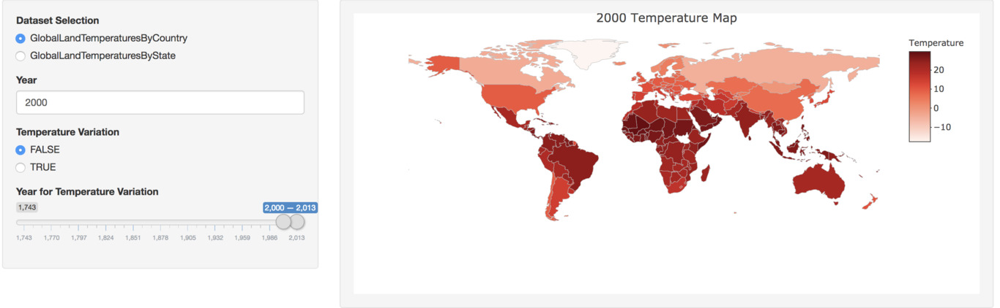

 

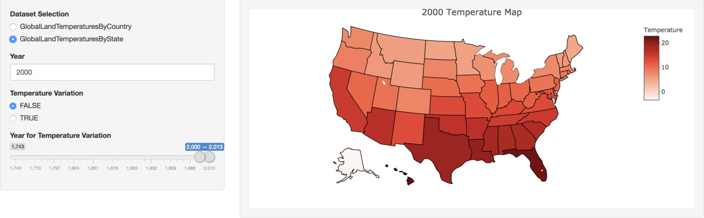

When you choose true for temperature variation, you can then analyze how temperature changed during the time period you select through the Year for Temperature Variation slider.

 

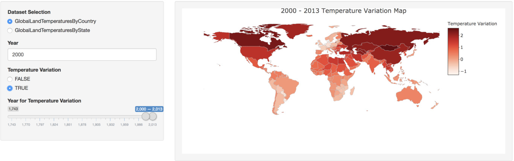

**Note:** the Year for Temperature Variation slider should only be used when you select the GlobalLandTemperaturesByCountry dataset.

### Calculator

+ **Input Selection**

The City has certain information about the air quality of that city you choose. Smoking is whether you smoke or not, if you smoke then select "yes". Exercise is whether you exercise or not, if you do, select "yes". Gene is whether your family has certain kind of gene that may cause disease, if they do, select "yes".

+ **Usage**

This part mainly calculate the summary statistic of the city you choose. For the health part, it gives a brief result of your health condition.

### Temperature Trend

+ **Dataset Selection**

You can choose global temperature or global land temperature by country to analyze the overall global temperature trend or temperature trend by country.

+ **Type Selection**

You can analyze either yearly average temperature or monthly average temperature trend.

When you choose global temperature dataset, the graphs will display properly for analysis.

 

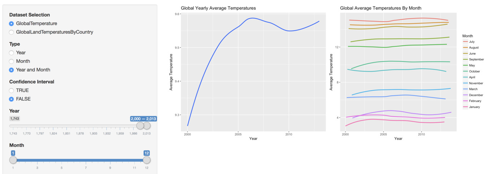

When you choose global land temperature by country dataset and want to compare temperature trend among different countries, the graphs will look narrow and you should choose either year or month type. And if you select month, select fewer month using Month slider can make the graphs look even better.

 

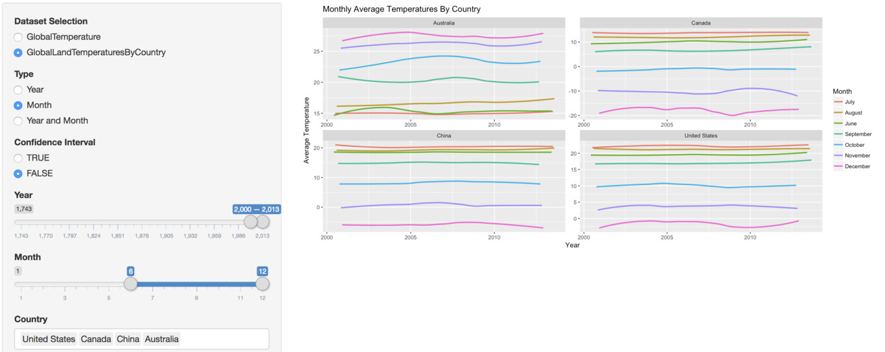

+ **Confidence Interval**

You can choose to display confidence interval around smooth.

 

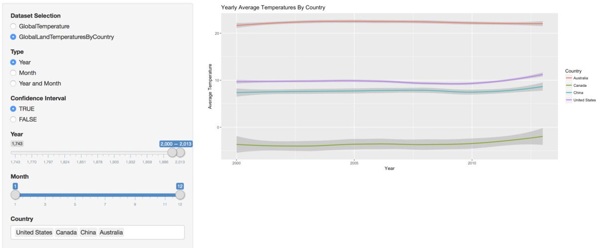

